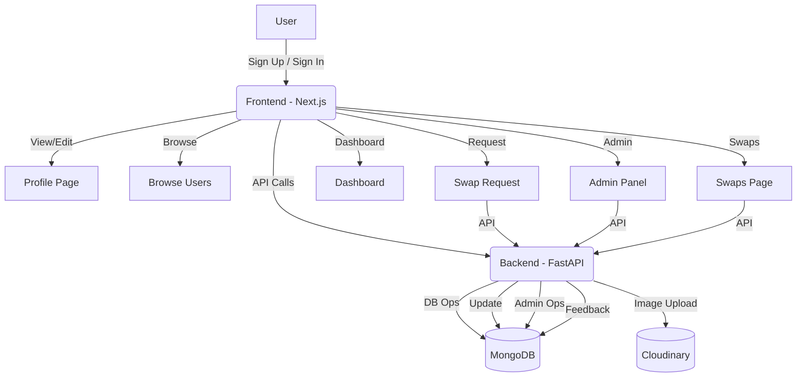

# Skill Swap Platform 🤝


A full-stack platform for users to exchange skills, manage swap requests, and connect with others. Built with FastAPI (Backend) and Next.js (Frontend).

---

**Team:** Bug Slayers 🐞⚔️

## Demo Video ▶️

[](https://www.youtube.com/watch?v=eUTK8BVW-QQ)

## Team Members & Contact 📧

| Name           | Email                        | LinkedIn                                                                 |
|----------------|------------------------------|--------------------------------------------------------------------------|
| Tirth Patel    | tirthpatel4822@gmail.com     | [linkedin.com/in/tirthpatel-7ab9ba264](https://www.linkedin.com/in/tirthpatel-7ab9ba264/) |
| Vyom Padalia   | vyompadalia028@gmail.com     | [linkedin.com/in/vyom-padalia](https://www.linkedin.com/in/vyom-padalia/?originalSubdomain=in) |
| Neel Sheth     | shethneel2022@gmail.com      | [linkedin.com/in/neel-sheth-91b362262](https://www.linkedin.com/in/neel-sheth-91b362262/) |
| Parth Thakkar  | parththakkar1208@gmail.com   | [linkedin.com/in/parth-thakkar-1812p5d](https://www.linkedin.com/in/parth-thakkar-1812p5d/) |

---

## Tech Stack 🚀

### Frontend
- **Next.js** (React Framework) ⚛️
- **Tailwind CSS** (Utility-first CSS) 🎨
- **Clerk Auth** (Authentication) 🔐
- **TypeScript** (Type safety) 🟦

### Backend
- **Python** 🐍
- **FastAPI** (Web framework) ⚡
- **MongoDB** (Database) 🍃
- **Cloudinary** (Image upload & storage) ☁️
- **Tunnel (e.g., ngrok)** (For local API testing) 🌐
- **Replit** (Backend deployment) 🚢

---

## Table of Contents 📚
- [Project Structure](#project-structure)
- [Backend Overview](#backend-overview)
  - [API Routes](#api-routes)
- [Frontend Overview](#frontend-overview)
  - [Main Pages & Functionality](#main-pages--functionality)
- [System Flow Diagram](#system-flow-diagram)
- [Setup & Installation](#setup--installation)

---

## Project Structure 🗂️

```
Skill-Swap-Platform/
│
├── Backend/
│   ├── app/
│   │   ├── main.py
│   │   ├── config.py
│   │   ├── controllers/
│   │   ├── database/
│   │   ├── models/
│   │   ├── routes/
│   │   ├── schemas/
│   │   ├── services/
│   │   └── utils/
│   ├── requirements.txt
│   └── run.py
│
├── Frontend/
│   ├── app/
│   │   ├── page.tsx (Home)
│   │   ├── dashboard/
│   │   ├── browse/
│   │   ├── profile/
│   │   ├── swaps/
│   │   ├── projects/
│   │   ├── admin/
│   │   ├── sign-in/
│   │   └── sign-up/
│   ├── components/
│   ├── hooks/
│   ├── lib/
│   └── styles/
└── README.md
```

---

## Backend Overview 🛠️

- **Framework:** FastAPI
- **Database:** MongoDB
- **Features:**
  - User registration, profile, and photo upload
  - Swap request management (create, accept, reject, cancel, feedback)
  - Admin controls (ban user, broadcast, view all users/swaps)

### API Routes 🔗

#### User Routes (`/users`) 👤
- `POST /users/` — Register a new user
- `GET /users/` — List all users
- `GET /users/{clerk_id}` — Get user by Clerk ID
- `PUT /users/{clerk_id}` — Update user profile
- `DELETE /users/{clerk_id}` — Delete user
- `POST /users/{clerk_id}/upload-photo` — Upload profile photo

#### Swap Routes (`/swaps`) 🔄
- `POST /swaps/request` — Create swap request
- `GET /swaps/my-swaps` — List my swaps
- `PUT /swaps/accept/{swap_id}` — Accept swap
- `PUT /swaps/reject/{swap_id}` — Reject swap
- `DELETE /swaps/cancel/{swap_id}` — Cancel swap
- `POST /swaps/feedback/{swap_id}` — Submit feedback

#### Admin Routes (`/admin`) 🛡️
- `GET /admin/users` — List all users (admin)
- `PUT /admin/ban/{user_id}` — Ban user (admin)
- `GET /admin/swaps` — List all swaps (admin)
- `POST /admin/broadcast` — Send broadcast message

---

## Frontend Overview 🎨

- **Framework:** Next.js (React) ⚛️
- **UI:** Tailwind CSS 🎨, Clerk Auth 🔐
- **Main Pages & Functionality:**
  - **Home:** 🏠 Landing page, sign in/up, intro
  - **Dashboard:** 📊 User stats, active swaps, quick actions
  - **Browse:** 🔍 Search/filter users, view profiles, request swaps
  - **Profile:** 👤 View/edit own profile, complete profile
  - **Swaps:** 🔄 Manage swap requests, feedback
  - **Projects:** 🗂️ Showcase or manage projects
  - **Admin:** 🛡️ Admin dashboard for user/swap management
  - **Sign In/Up:** 🔐 Authentication flows

---

## System Flow Diagram 🗺️



---

## Setup & Installation ⚙️

1. **Backend:**
   - `cd Backend`
   - Install dependencies: `pip install -r requirements.txt` or use Poetry
   - Run: `python run.py` or `uvicorn app.main:app --reload`

2. **Frontend:**
   - `cd Frontend`
   - Install dependencies: `pnpm install` or `npm install`
   - Run: `pnpm dev` or `npm run dev`

---
